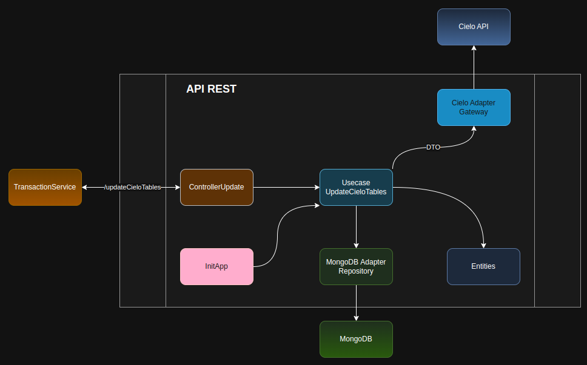

# EMV PASS - Cielo Tables
A aplicação Cielo Tables é responsável por gerenciar a atualização de informações sobre Products, Bins e EMVs da Cielo.

Se trata de uma API REST que recebe solicitações de atualização destes dados, isolando esta regra de negócio do restante do fluxo, evitando processamento desnecessário e/ou sobreposto, desperdicio de recursos e inconsistencia dos dados, fazendo com que o restante do fluxo do EMV PASS seja responsável apenas pelo processamento de transações EMV.

Desenvolvida em NodeJS e Typescript em suas versões mais recentes, onde sua maioria de funcionalidades são desenvolvidas utilizando os recusos nativos do NodeJS, utilizando apenas a lib **mongodb** para se integrar ao banco de dados MongoDB e Jest para testes automatizados.


<details>
    <summary>Clonagem de repositório e preparação de ambiente de desenvolvimento</summary>

### Tutorial
- Instale o [NVM](https://www.digitalocean.com/community/tutorials/how-to-install-node-js-on-ubuntu-22-04) (Node Version Manager) que é o gerênciador de versões do NodeJS.
- Instale a versão mais atual do NodeJS:
```shell
npm install --lts
```
- Clone o repositório:
```shell
git clone git@github.com:prodatamobilitybrasil/pmb.abt.EMVPass.cieloTables.git
```
- Instale as dependencias:
```shell
npm install
```

- Atualize as variáveis de ambiente em seu arquivo .env com as variáveis de ambiente de desenvolvimento:
```shell
ENVIRONMENT="DEV"

# Mongo DB Credentials
MONGO_CONN_STR="mongodb://172.24.11.73:27017/LOCAL_ABT"
MONGO_DB_NAME="LOCAL_EMV"

# Cielo APIs
CIELO_AUTH_TOKEN="https://authsandbox.cieloecommerce.cielo.com.br/oauth2/token"
CIELO_TABLES="https://parametersdownloadsandbox.cieloecommerce.cielo.com.br/api/v0.1/initialization/00000001"

CIELO_CLIENT_ID="26fac498-0460-4442-82c6-27d5aae3d61f"
CIELO_CLIENT_SECRET="1jU3CmDUx4QqcRpvgNcJiYkWUsQbGbeZOYS1P00O1uI="
CIELO_GRANT_TYPE="client_credentials"

PORT="8082"

```
**OBS:** Para execução da aplicação é necessário estar conectado a rede interna da Prodata seja presencialmente ou através de VPN.
- Teste sua aplicação:
```shell
npm test
```

- Execute em ambiente de desenvolvimento:
```shell
npm run dev
```
</details>

